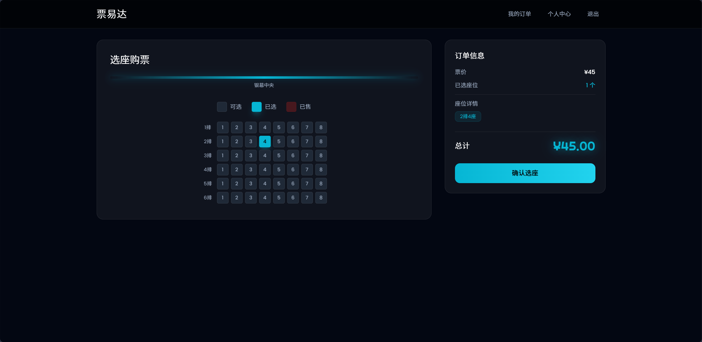
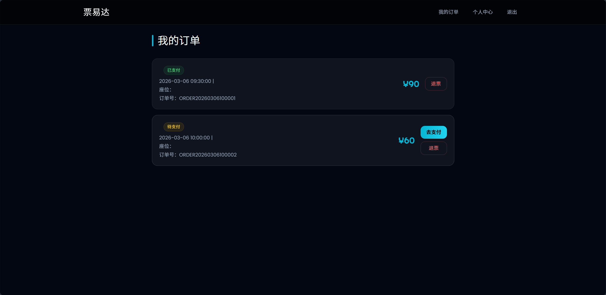
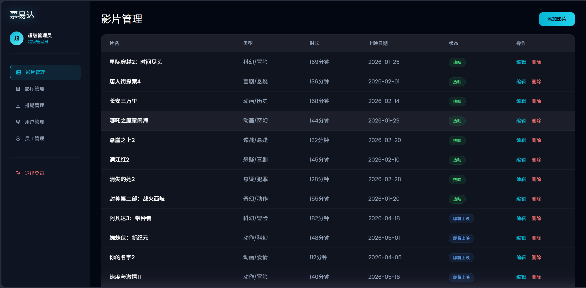
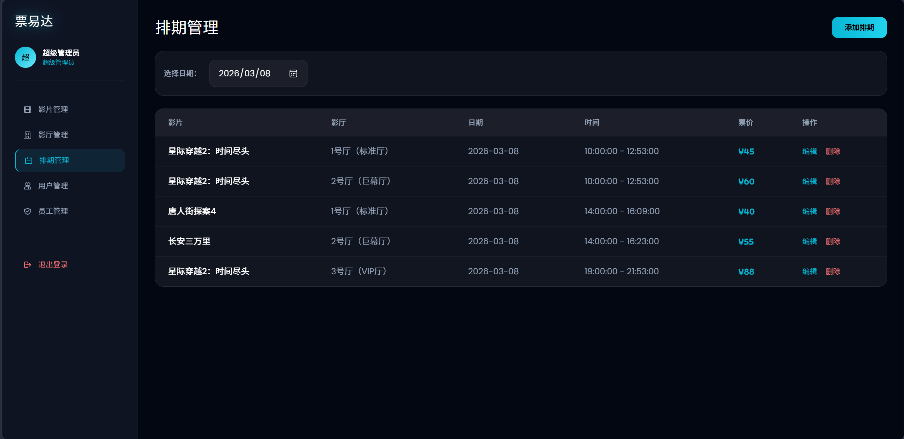
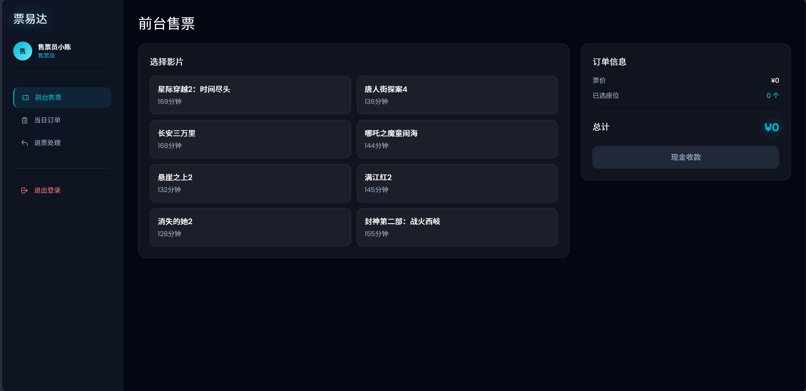
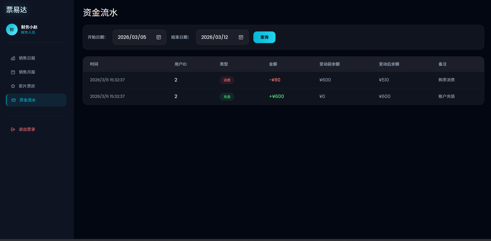

# 🎬 电影院票务管理系统

一个功能完整的电影院票务管理系统，支持在线购票、座位选择、订单管理、影院管理等功能。采用前后端分离架构，提供用户端和管理端双重界面。

## 📸 系统截图

### 用户端界面

**首页 - 影片列表**


**影片详情**


**座位选择**



**我的订单**



### 管理端界面

**影片管理**



**排期管理**



**售票界面**



**财务报表**



## ✨ 主要功能

### 用户端功能
- 🎥 **影片浏览**：查看热映、即将上映的影片信息
- 🎫 **在线购票**：选择场次、座位，在线支付
- 💺 **座位选择**：可视化座位图，实时显示座位状态
- 📋 **订单管理**：查看订单历史，支持退票（开场前2小时）
- 👤 **个人中心**：管理个人信息、充值余额、查看流水
- 🔐 **安全支付**：支付密码验证，余额支付

### 管理端功能

#### 管理员
- 🎬 **影片管理**：添加、编辑、删除影片信息
- 🏛️ **影厅管理**：配置影厅、设置座位布局
- 📅 **排期管理**：创建放映排期、设置票价
- 👥 **用户管理**：查看用户信息、禁用账号
- 👨‍💼 **员工管理**：管理售票员和财务人员账号

#### 售票员
- 🎟️ **线下售票**：为现场顾客售票
- 📊 **今日订单**：查看当日订单情况
- 💸 **退票处理**：处理用户退票申请

#### 财务
- 📈 **日报表**：统计每日销售数据
- 📊 **月报表**：统计月度销售数据
- 💰 **影片收入**：按影片统计票房收入
- 💳 **余额流水**：查看用户充值、消费、退款记录

## 🛠️ 技术栈

### 后端技术
- **框架**：Spring Boot 3.2.0
- **安全**：Spring Security + JWT
- **持久层**：MyBatis Plus 3.5.5
- **数据库**：MySQL 8.0
- **缓存**：Redis（分布式锁防超卖）
- **构建工具**：Maven

### 前端技术
- **框架**：Vue 3.4.0
- **路由**：Vue Router 4.2.5
- **状态管理**：Pinia 2.1.7
- **HTTP客户端**：Axios 1.6.2
- **UI样式**：Tailwind CSS 3.4.0
- **构建工具**：Vite 5.0.0

## 📁 项目结构

```
cinema-ticket-system/
├── back/                          # 后端项目
│   ├── src/main/java/com/cinema/
│   │   ├── config/               # 配置类（JWT、Security、Redis等）
│   │   ├── controller/           # 控制器层
│   │   ├── service/              # 业务逻辑层
│   │   ├── mapper/               # 数据访问层
│   │   ├── entity/               # 实体类
│   │   ├── common/               # 公共类
│   │   └── exception/            # 异常处理
│   ├── src/main/resources/
│   │   └── application.yml       # 应用配置
│   ├── sql/
│   │   ├── init.sql             # 数据库初始化脚本
│   │   └── test_data.sql        # 测试数据
│   └── pom.xml                   # Maven配置
│
└── front/                         # 前端项目
    ├── src/
    │   ├── api/                  # API接口
    │   ├── components/           # 公共组件
    │   ├── views/                # 页面组件
    │   │   ├── admin/           # 管理端页面
    │   │   └── ...              # 用户端页面
    │   ├── router/               # 路由配置
    │   ├── stores/               # 状态管理
    │   └── utils/                # 工具函数
    └── package.json              # npm配置
```

## 🗄️ 数据库设计

### 核心表结构

- **user** - 用户表（支持多角色：user/seller/finance/admin）
- **movie** - 影片表（标题、海报、导演、演员、时长等）
- **hall** - 影厅表（名称、行数、列数、总座位数）
- **hall_seat** - 座位表（影厅座位布局配置）
- **schedule** - 排期表（影片、影厅、时间、票价）
- **order** - 订单表（订单号、用户、排期、状态、来源）
- **order_seat** - 订单座位关联表
- **balance_log** - 余额流水表（充值、消费、退款记录）

## 🚀 快速开始

### 环境要求

- JDK 17+
- Maven 3.6+
- MySQL 8.0+
- Redis 6.0+
- Node.js 16+

### 后端启动

1. 创建数据库并导入数据
```bash
# 登录MySQL
mysql -u root -p

# 创建数据库
CREATE DATABASE cinema_ticket DEFAULT CHARACTER SET utf8mb4 COLLATE utf8mb4_unicode_ci;

# 导入初始化脚本
mysql -u root -p cinema_ticket < back/sql/init.sql
mysql -u root -p cinema_ticket < back/sql/test_data.sql
```

2. 修改配置文件
```bash
# 编辑 back/src/main/resources/application.yml
# 修改数据库连接信息和Redis配置
```

3. 启动后端服务
```bash
cd back
mvn clean install
mvn spring-boot:run
```

后端服务将在 `http://localhost:8080` 启动

### 前端启动

1. 安装依赖
```bash
cd front
npm install
```

2. 启动开发服务器
```bash
npm run dev
```

前端服务将在 `http://localhost:5173` 启动

## 👤 测试账号

系统预置了以下测试账号（密码均为 `admin123`）：

| 角色 | 手机号 | 说明 |
|------|--------|------|
| 管理员 | 13800000000 | 拥有所有权限 |
| 售票员 | 13800001111 | 线下售票、退票 |
| 售票员 | 13800002222 | 线下售票、退票 |
| 财务 | 13800003333 | 查看财务报表 |
| 普通用户 | 13900001111 | 余额500元 |
| 普通用户 | 13900002222 | 余额200元 |
| 普通用户 | 13900003333 | 余额0元 |

## 🔐 安全机制

- **密码加密**：使用 BCrypt 加密存储登录密码和支付密码
- **JWT认证**：Token有效期7天，自动续期
- **权限控制**：基于角色的访问控制（RBAC）
- **分布式锁**：使用 Redis 防止座位超卖
- **支付验证**：支付时需验证支付密码
- **退票限制**：开场前2小时内不支持退票

## 📝 主要业务流程

### 用户购票流程
1. 用户登录系统
2. 浏览影片列表，选择感兴趣的影片
3. 查看影片详情和排期信息
4. 选择场次，进入座位选择页面
5. 选择座位，创建订单
6. 输入支付密码，完成支付
7. 查看订单详情，可在规定时间内退票

### 管理员管理流程
1. 登录管理后台
2. 添加影片信息（标题、海报、导演、演员等）
3. 配置影厅和座位布局
4. 创建放映排期，设置票价
5. 管理用户和员工账号
6. 查看系统运营数据

### 售票员操作流程
1. 登录售票系统
2. 为现场顾客选择影片和场次
3. 选择座位，创建线下订单
4. 收款完成售票
5. 处理退票申请

### 财务报表流程
1. 登录财务系统
2. 查看日报表/月报表
3. 分析影片收入情况
4. 审核余额流水记录

## 🎯 核心特性

### 防超卖机制
使用 Redis 分布式锁确保同一座位不会被重复售出：
- 创建订单时对座位加锁
- 检查座位是否已售
- 事务提交后释放锁

### 订单状态管理
- **unpaid** - 未支付（创建订单后）
- **paid** - 已支付（支付成功后）
- **completed** - 已完成（观影结束后）
- **refunded** - 已退款（退票成功后）
- **cancelled** - 已取消（超时未支付）

### 余额流水记录
所有余额变动都会记录流水：
- **recharge** - 充值
- **consume** - 消费（购票）
- **refund** - 退款（退票）

## 🔧 配置说明

### 后端配置 (application.yml)
```yaml
server:
  port: 8080

spring:
  datasource:
    url: jdbc:mysql://localhost:3306/cinema_ticket
    username: root
    password: your_password
  
  data:
    redis:
      host: localhost
      port: 6379

jwt:
  secret: cinema-ticket-system-secret-key-2026
  expiration: 604800000  # 7天
```

### 前端配置 (vite.config.js)
```javascript
server: {
  port: 5173,
  proxy: {
    '/api': 'http://localhost:8080',
    '/uploads': 'http://localhost:8080'
  }
}
```

## 📦 部署说明

### 后端部署
```bash
# 打包
cd back
mvn clean package -DskipTests

# 运行
java -jar target/cinema-ticket-0.0.1-SNAPSHOT.jar
```

### 前端部署
```bash
# 构建
cd front
npm run build

# 部署 dist 目录到 Nginx 或其他 Web 服务器
```

## 🤝 贡献指南

欢迎提交 Issue 和 Pull Request！

## 📄 许可证

MIT License

## 📧 联系方式

2929026775@qq.com

如有问题或建议，欢迎联系。

---

⭐ 如果这个项目对你有帮助，请给个 Star！
